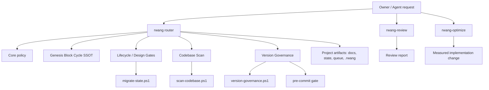

# Architecture — RWANG Skill Consolidation

## 1. Purpose

เอกสารนี้เป็น **Single Source of Truth (SSOT)** สำหรับ architecture และ refinement ของ RWANG skill bundle ตั้งแต่รุ่น 2.x เป็นต้นไป โดยเป็นเจ้าของคำตอบต่อไปนี้:

- RWANG มี public skills กี่ตัว และแต่ละตัวรับผิดชอบอะไร
- command ใด route ไป capability ใด
- policy, lifecycle, scan, version governance, scripts และ templates อยู่ที่ใด
- brownfield ต้องพิสูจน์ code truth ก่อน planning อย่างไร
- 7-Phase Block Assembly และ 12-Stage Block Decomposition เชื่อมกับ RWANG อย่างไร
- versioning ของ Git, release และ governed artifacts แบ่ง authority กันอย่างไร
- installer และ project init รักษา global SSOT โดยไม่สร้างสำเนาอย่างไร
- project รุ่น 1.x และ legacy commands migrate ไป 2.x อย่างไร

เอกสาร runtime/reference อื่นต้องอ้างเอกสารนี้สำหรับ topology และ ownership ห้ามนิยาม architecture ของ skill bundle แข่งกัน หากต้องเปลี่ยน boundary ที่ระบุในเอกสารนี้ ต้องใช้ Architecture Change Request

## 2. Decision summary

RWANG ใช้ architecture แบบ **one primary entrypoint + two bounded specialist skills**:

| Public skill | Responsibility | Mutation boundary |
|---|---|---|
| `rwang` | init, scan, plan, continue, status และ governed-artifact version operations | เปลี่ยน project governance/docs/state ตาม command และ approval gate |
| `rwang-review` | deterministic checks + evidence-backed engineering review | report-only; ห้ามแก้ implementation |
| `rwang-optimize` | measured implementation optimization | แก้ private implementation ได้เมื่อมี baseline/test/re-measurement |

Core, QuickStart, MasterPlan และ Version ไม่เป็น public skills แยกอีกต่อไป แต่กลายเป็น capability modules ภายใน `rwang`

## 3. Problem statement and evidence

โครงสร้าง 1.x มี public skills หกตัว:

1. `rwang-core`
2. `rwang-masterplan`
3. `rwang-version`
4. `rwang-quickstart`
5. `rwang-review`
6. `rwang-optimize`

ปัญหาที่ตรวจพบจาก installed bundle และ source repository:

### 3.1 Duplicate and split SSOT

- `rwang-masterplan` บรรจุสำเนา Core, Version, Review, Optimize และ pre-commit ไว้ภายใน
- สำเนา Core และ pre-commit ซ้ำ byte-for-byte กับ sibling skills
- สำเนา Version ภายใน MasterPlan เก่ากว่า `rwang-version` และใช้ governed-scope semantics คนละรุ่น
- project-local module copy สามารถชนะ installed module แบบเงียบ ทำให้แต่ละ project ใช้ protocol คนละรุ่น

### 3.2 Broken references

- `rwang-review/SKILL.md` อ้าง `RWANG-REVIEW.md` ที่ไม่มีใน skill directory
- `rwang-optimize/SKILL.md` อ้าง `RWANG-OPTIMIZE.md` ที่ไม่มีใน skill directory

### 3.3 Conflicting onboarding behavior

- legacy Init สั่ง copy RWANG modules เข้า project root
- QuickStart/MasterPlan รุ่นใหม่สั่งห้าม copy modules และใช้ installed skill เป็น SSOT
- legacy Init ข้าม Master Plan sub-gate ไปสร้าง Phase 0 package ทั้งชุด ขณะที่ protocol ใหม่บังคับ owner review ก่อน

### 3.4 Planning without code truth

MasterPlan 1.x inventory เฉพาะ owner materials, docs, queue และ state แต่ไม่ได้บังคับอ่าน source roots, entrypoints, manifests, tests, routes, schemas หรือ representative implementations ก่อนเขียน plan

### 3.5 Vocabulary collision

- Genesis Block ใช้ `P0..P6` เป็น 7-Phase Block Assembly ที่รวม implementation และ audit
- MasterPlan ใช้ Phase 0–6 เป็นงาน design/docs แล้วเพิ่ม Phase 7 implementation

ชื่อ “phase” และเลข 0–6 จึงหมายถึงคนละ lifecycle

### 3.6 Overextended version control

แนวทาง per-file SemVer สำหรับ code ทุกไฟล์ซ้ำหน้าที่ Git, เพิ่ม sidecars และ commit friction โดยไม่เพิ่ม product-level release truth

## 4. Goals

- เหลือ public skills เท่าที่จำเป็นและมี responsibility ชัดเจน
- ผู้ใช้เริ่มจาก `$rwang` หรือ `RWANG:<command>` เป็นหลัก
- มี SSOT เดียวต่อ concern และไม่มี bundled payload ซ้ำ
- brownfield planning ต้องยึด code/runtime evidence ไม่ใช่เอกสารอย่างเดียว
- Genesis Block terminology ใช้ความหมายเดียวทั่ว bundle
- Git, release SemVer และ artifact governance ไม่แย่ง authority กัน
- install/upgrade ทำได้แบบ recoverable และไม่ลบ local skill payload ทิ้งถาวร
- project init เชื่อม global SSOT โดยไม่ copy module payload
- validation ตรวจ regression เชิงโครงสร้างและ functional behavior ได้

## 5. Non-goals

- ไม่รวม Review และ Optimize เป็น execution mode ภายใน umbrella จน role boundary หาย
- ไม่ทำ Full 12-Stage Block Decomposition ในทุก project โดยอัตโนมัติ
- ไม่ใช้ `.rwang` แทน Git หรือ package release version
- ไม่ auto-approve Master Plan, Design Gate, Architecture Change Request หรือ implementation merge
- ไม่ auto-edit upstream Cognitive System เมื่อ operational SSOT ของ RWANG เปลี่ยน
- ไม่รับรอง explicit legacy `$rwang-*` selectors ที่ไม่มี installed skill folder ในรุ่น 2.x

## 6. Architecture principles

### A1 — One primary entrypoint, not one monolithic instruction file

ผู้ใช้เห็น entrypoint หลักเดียว แต่ภายในแยก references, scripts และ templates ตาม concern เพื่อไม่โหลดกฎที่ไม่เกี่ยวข้องทุกครั้ง

### A2 — Role boundaries remain physical

Review เป็น report-only ส่วน Optimize เป็น measured mutation workflow จึงคงเป็นคนละ skill เพื่อป้องกัน permission และ execution semantics ปะปนกัน

### A3 — Reality precedes planning

owner intent และ docs เป็น input แต่ไม่ถือเป็น confirmed code truth จนกว่าจะตรวจ source/runtime/test evidence

### A4 — Deterministic mechanics live in scripts

hashing, state migration, scan inventory, version audit และ installer migration ต้องใช้ deterministic scripts แทนให้ agent เขียน metadata จากความจำ

### A5 — Installed bundle is the module SSOT

project เก็บเฉพาะ project artifacts และ pointer/link ไป installed skills ห้าม copy RWANG module payload ไป project root

### A6 — Honest incompleteness

inventory ไม่เท่ากับ reality validation และ grep ไม่เท่ากับ completed Symbol Graph สถานะที่ยังไม่ครบต้องเป็น `pending`, `incomplete` หรือ `unknown`

## 7. System topology



## 8. Public command contract

| Invocation | Canonical behavior | Default mutation | Stop condition |
|---|---|---|---|
| `RWANG:init` | inventory, classify repository, initialize explicit governance, scan, draft Master Plan | project governance/docs/state | Master Plan owner-review gate |
| `RWANG:scan` | L0/L1 scan ตาม repository kind | evidence artifacts | evidence packet created; brownfield remains blocked until validated |
| `RWANG:scan --deep` | prepare/execute L2 canonical 12-stage evidence | evidence + graph artifacts | all stages complete/N/A or explicitly incomplete |
| `RWANG:plan` | create/revise plan from owner intent + current code truth | Master Plan/review docs | Master Plan owner-review gate |
| `RWANG:continue` | resume current Design Gate or Execution wave | phase-appropriate artifacts | next owner gate/blocker |
| `RWANG:status` | report evidence, state, scope, drift, blockers, next action | none | report returned |
| `RWANG:version audit` | audit governed artifacts | none | clean or findings |
| `RWANG:version register` | register explicit in-scope artifact | `.rwang` sidecar/index | artifact registered |
| `RWANG:version bump` | update hash/version/changelog | `.rwang` sidecar/index | bump recorded |
| `RWANG:version fix` | repair deterministic index drift only | `.rwang` index | deterministic fixes applied; semantic gaps remain open |
| `RWANG:Review` | deterministic checks then judgment review | review document/event only | verdict returned |
| `RWANG:Optimize` | baseline → change → test → re-measure | implementation/tests/evidence | improvement retained or experiment reverted |

## 9. Internal module ownership

| Module | Owns | Must not own |
|---|---|---|
| `references/CORE.md` | behavior rules, complexity/risk, RCA and Definition of Done | project lifecycle numbering |
| `references/GENESIS-BLOCK-CYCLE.md` | Block Assembly P0–P6 และ Block Decomposition Stage 1–12 | RWANG Design Gate state machine |
| `references/LIFECYCLE.md` | DG0–DG6 + Execution, approvals, continuation, state migration semantics | Genesis phase/stage redefinition |
| `references/CODEBASE-SCAN.md` | L0/L1/L2 invocation and evidence gates | canonical phase/stage semantics |
| `references/VERSION-GOVERNANCE.md` | governed scope, audit/register/bump/fix contracts | Git history or release ownership |
| `references/LEGACY-ALIASES.md` | plain-text alias routing and breaking selector disclosure | long-term command duplication |
| `scripts/` | deterministic mechanics | architectural judgment or owner approval |
| `templates/` | canonical artifact skeletons | runtime dispatch logic |

## 10. Reality-before-planning architecture

### 10.1 Repository classification

- **Greenfield:** ไม่มี implementation source หรือ executable manifest; ใช้ L0 และบันทึกว่าไม่มี codebase ให้ scan
- **Brownfield:** มี source, executable manifest หรือ deployed runtime; ต้องมี L1/L2 evidence ก่อน Master Plan

### 10.2 Scan profiles

| Profile | Purpose | Completion meaning |
|---|---|---|
| L0 | repository/owner/state inventory | readiness classification เท่านั้น |
| L1 | bounded codebase reality scan | agent อ่าน representative implementation และเติม confirmed truth/drift/unknowns แล้ว |
| L2 | canonical 12-stage Block Decomposition | Stage 1–12 complete หรือ evidenced N/A พร้อม graph validation |

`scan-codebase.ps1` สร้าง evidence packet และ inventory แต่สำหรับ brownfield ต้องคืน `planning_gate_satisfied = false` จน agent validation เสร็จ ห้าม helper self-certify code understanding

## 11. Genesis Block integration

Normative phase/stage semantics อยู่ที่ `skills/rwang/references/GENESIS-BLOCK-CYCLE.md`

- P0–P6 เป็น artifact lifecycle จาก Frame ไป Audit/Handover
- Stage 1–12 เป็น code-to-knowledge decomposition
- Decomposition feedback กลับ P2/P3 ผ่าน evidence และ approval ไม่แก้ governed design โดยตรง
- L0/L1 เป็น RWANG readiness/evidence profiles ไม่ใช่การ rename 12 stages

## 12. Lifecycle architecture

RWANG planning ใช้:

```text
DG0 Discovery
→ DG1 Architecture
→ DG2 Contracts
→ DG3 Agent Design
→ DG4 Implementation Specification
→ DG5 Quality
→ DG6 Handoff
→ Execution
```

Design Gates เป็น governance envelope ส่วน Genesis `P0..P6` เป็น artifact flow ทั้งสองไม่ map แบบหนึ่งต่อหนึ่งโดยอัตโนมัติ State และ report ต้องระบุ axis เมื่อมีมากกว่าหนึ่งแกน

### 12.1 Master Plan sub-gate

DG0 เริ่มด้วย `MASTER_PLAN.md` และ `MASTER_PLAN_REVIEW.md` แล้วหยุดรอ owner approval ก่อนสร้าง discovery package ที่เหลือ การ approve Master Plan ไม่เท่ากับ approve DG0

### 12.2 Design Gate approval

Owner เป็นผู้มีอำนาจ approve แต่เพียงผู้เดียว Approved gate ถูก freeze; breaking architecture change ต้องมี approved `ARCHITECTURE_CHANGE_REQUEST.md`

### 12.1 C-1 brownfield maintenance boundary

The Execution gate governs new planned feature and architecture work. It does not retroactively block a direct C-1 maintenance/hotfix edit in an existing brownfield codebase when risk is LOW, scope is explicit, verification is in place, and no public contract, schema, module/folder boundary, security policy, or migration behavior changes. Crossing any boundary escalates to C-2/C-3 and the applicable Design Gate.

## 13. Version-governance architecture

| Authority | Owns |
|---|---|
| Git | source history, diff, commit identity |
| Package/application SemVer | release compatibility/version |
| `.rwang` sidecar | approval state, governed-artifact SemVer, hash drift, changelog |

Default governed scope จำกัดที่ specs, ADRs, schemas, policies, contracts และ approved deliverables ห้าม include `src/**` โดยปริยาย

### 13.1 Write gate

pre-commit ตรวจเฉพาะ registered governed artifacts โดย original และ sidecar ต้อง staged พร้อมกันและ hash ต้องตรง ห้าม overwrite existing hook; ให้ merge gate ด้วยมือ

### 13.2 Mutation events

เมื่อ project มี `state/PROJECT_STATE.json`, register/bump/fix ต้อง append event ลง `state/events.jsonl` ส่วน audit/status คง read-only

## 14. Installation and distribution architecture

### 14.1 Global SSOT

```text
~/.rwang/                 toolkit source snapshot
~/.agents/skills/         three installed public skills — execution SSOT
~/.claude/skills/         links to ~/.agents/skills
~/.gemini/.../skills/     links when harness exists
```

Installer ใช้ allowlist ตายตัว:

- `rwang`
- `rwang-review`
- `rwang-optimize`

ห้าม install ทุก directory ใต้ `skills/` โดยอัตโนมัติ เพราะ directory ภายในอาจเป็น internal module หรือ migration artifact

### 14.2 Recoverable upgrade

- real directories เดิมถูกย้ายไป timestamped `~/.rwang/legacy-backups/`
- symlink/junction เดิมถูกถอดเฉพาะ link
- clean skill payload ถูกติดตั้งใหม่เพื่อไม่ให้ stale files ค้าง
- backup collision ทำให้ installer fail แทน overwrite

### 14.3 Project initialization

`rwang-init.ps1/.sh`:

- ต้องมี global installation ก่อน
- เพิ่ม pointer `AGENTS.md` / `CLAUDE.md` เฉพาะเมื่อยังไม่มี
- link project `.agents/skills/<name>` ไป global SSOT
- ปฏิเสธการ overwrite project-local real skill copy
- ไม่ copy RWANG module files เข้า project root

## 15. State schema and migration

2.x state ใช้ fields หลัก:

```json
{
  "repository_kind": "greenfield | brownfield",
  "current_design_gate": "DG0 | ... | DG6 | Execution",
  "gate_status": "not_started | in_progress | awaiting_approval | approved",
  "master_plan_status": "not_started | awaiting_approval | approved",
  "approved_design_gates": [],
  "scan_evidence": {}
}
```

Migration จาก 1.x:

1. สำรอง state bytes เดิมที่ `state/migrations/PROJECT_STATE.v1.json`
2. map `current_phase` → `current_design_gate`
3. map `phase_status` → `gate_status`
4. preserve `master_plan_status`
5. map `approved_phases` → `approved_design_gates`
6. preserve legacy `PHASE_<N>_REVIEW.md`
7. append `StateMigrated` event
8. refuse mixed/ambiguous schema และ backup collision

## 16. Compatibility policy

Plain-text aliases ยัง route ใน migration window:

| Legacy text | Canonical route |
|---|---|
| `RWANG:QuickStart` | `RWANG:init` |
| `RWANG:MasterPlan` | `RWANG:plan` หรือ `RWANG:continue` |
| `RWANG:Core` | automatic Core reload |
| `RWANG:Version` | `RWANG:version` |

Explicit selectors `$rwang-quickstart`, `$rwang-masterplan`, `$rwang-core`, `$rwang-version` เป็น intentional breaking removals ใน 2.0 เพราะ harness resolve ด้วย installed skill name และ umbrella ไม่สามารถ intercept selector ที่ไม่มี folder ได้

## 17. Canonical source layout

```text
RWANG-PROMAX/
├─ docs/
│  └─ ARCHITECTURE--RWANG-SKILL-CONSOLIDATION.md
├─ skills/
│  ├─ rwang/
│  │  ├─ SKILL.md
│  │  ├─ references/
│  │  │  ├─ CORE.md
│  │  │  ├─ GENESIS-BLOCK-CYCLE.md
│  │  │  ├─ LIFECYCLE.md
│  │  │  ├─ CODEBASE-SCAN.md
│  │  │  ├─ VERSION-GOVERNANCE.md
│  │  │  └─ LEGACY-ALIASES.md
│  │  ├─ scripts/
│  │  └─ templates/
│  ├─ rwang-review/
│  └─ rwang-optimize/
├─ scripts/
│  ├─ validate-bundle.ps1
│  ├─ test-functional.ps1
│  ├─ test-installers.ps1
│  └─ test-installers.sh
├─ install.ps1 / install.sh
└─ rwang-init.ps1 / rwang-init.sh
```

## 18. Failure modes and controls

| Failure mode | Control |
|---|---|
| duplicate/stale SSOT | validator ตรวจ duplicate Markdown payload และ required references |
| plan จาก docs โดยไม่อ่าน code | brownfield planning gate + `planning_gate_satisfied=false` จน validated |
| อ้าง L2 complete จาก grep | Genesis SSOT per-stage completion contracts |
| installer ลบ local edits | timestamped recoverable backups |
| upgrade ทิ้ง stale files | backup/replace clean install |
| project copy protocol เก่า | global links; refuse real project-local skill overwrite |
| version system แข่งกับ Git | explicit authority table และไม่ govern `src/**` โดย default |
| phase semantics ชนกัน | P0–P6 reserved; planning ใช้ DG0–DG6 |
| Review แก้ code | physical separate report-only skill |
| Optimize เปลี่ยน architecture | explicit boundary + ACR stop |
| state migration ทำข้อมูลหาย | byte-preserving backup + event + collision refusal |

## 19. Rejected alternatives

### R-A — One giant skill containing every workflow

ปฏิเสธเพราะ Review และ Optimize มี mutation boundary ตรงข้ามกัน และ giant prompt ทำให้โหลด rules ที่ไม่เกี่ยวข้อง เพิ่ม context cost และเสี่ยง route ผิด

### R-B — Keep all six skills and only fix broken files

ปฏิเสธเพราะไม่แก้ trigger overlap, duplicate SSOT, conflicting onboarding และ user command complexity

### R-C — Merge Review and Optimize into umbrella

ปฏิเสธเพราะทำให้ report-only กับ mutating workflow อยู่ใน skill เดียวกันและ permission boundary ไม่ชัด

### R-D — Keep Version as independent public skill

ปฏิเสธสำหรับ default UX เพราะ version operations เป็น governance subcommand ของ project lifecycle แต่เก็บ engine แยกภายในเพื่อ deterministic execution

### R-E — Run full 12-stage decomposition on every init

ปฏิเสธเพราะเกินความจำเป็นสำหรับ greenfield/small repos และหลาย stage ต้องใช้ parser/framework adapters/graph runtime ที่อาจไม่มี L1 เป็น minimum brownfield gate; L2 ใช้ตาม complexity/evidence need

### R-F — Preserve explicit legacy selectors with duplicate shim skills forever

ปฏิเสธเพราะทำให้ public skill count และ duplicate trigger surface กลับมา Legacy plain text มี migration route; explicit selector break ถูกประกาศใน major release

## 20. Acceptance criteria

- [x] public skill set มี `rwang`, `rwang-review`, `rwang-optimize` เท่านั้น
- [x] Review/Optimize มี bundled SSOT ที่ reference resolve ได้
- [x] ไม่มี duplicate Markdown module payload
- [x] มี combined Genesis Block Cycle SSOT ครบ P0–P6 และ Stage 1–12
- [x] CODEBASE-SCAN/LIFECYCLE consume Genesis SSOT แทน redefinition
- [x] brownfield helper ไม่ self-approve planning gate
- [x] state migration preserve Master Plan sub-gate และ backup
- [x] version governance ไม่ include `src/**` โดย implicit default
- [x] installer allowlist มีสาม skills
- [x] Windows/Unix installer backup และ clean replacement ผ่าน isolated tests
- [x] project init link global SSOT โดยไม่ copy skills
- [x] PowerShell/shell syntax และ `git diff --check` ผ่าน
- [ ] owner ตัดสินใจ commit/push/install รุ่น candidate นี้

## 21. Verification evidence

คำสั่ง validation canonical:

```powershell
./scripts/validate-bundle.ps1
./scripts/test-functional.ps1
./scripts/test-installers.ps1
```

```sh
sh ./scripts/test-installers.sh
```

ผลล่าสุด ณ 2026-07-19:

- bundle structure: pass
- required/inline references: pass
- duplicate payload detection: pass
- canonical 7-phase/12-stage validation: pass
- brownfield scan gate: pass
- state migration: pass
- governed artifact register/audit/drift/bump: pass
- isolated Windows installer/init: pass
- isolated Unix installer/init: pass
- PowerShell/shell parse: pass
- `git diff --check`: pass

## 22. Change control

การเปลี่ยนต่อไปนี้เป็น MAJOR:

- เพิ่ม/ลด public skill
- ย้าย responsibility ระหว่าง umbrella, Review และ Optimize
- เปลี่ยน authority ของ Git/release/sidecar
- ยกเลิก brownfield evidence gate
- เปลี่ยน Design Gate model หรือ Genesis phase/stage ownership
- เปลี่ยน installation SSOT หรือกลับไป project-local module copies

ต้องมี Architecture Change Request, impact analysis, migration plan, owner approval และ validation update

การเพิ่ม command ย่อยหรือ evidence field ที่ backward-compatible เป็น MINOR; clarification/formatting เป็น PATCH

## 23. Version diff

| Component | Before | After | Reason |
|---|---|---|---|
| public skill topology | 6 skills | 3 skills | ลด overlap และสร้าง boundary ชัดเจน |
| `rwang` | ไม่มี | `2.1.1-beta` | umbrella + reality gate + Genesis SSOT + runtime/installer hardening |
| `rwang-review` | 1.0.x, missing SSOT | `1.1.0` | restore SSOT + Design Gate alignment |
| `rwang-optimize` | 1.0.x, missing SSOT | `1.1.0` | restore SSOT + Design Gate alignment |
| Core/MasterPlan/Version/QuickStart | public skills | internal capabilities/legacy text routes | single primary entrypoint |

## 24. Current release state

Architecture และ implementation อยู่สถานะ `beta` ใน source checkout `D:/rwang/RWANG-PROMAX-skills` ยังไม่ได้ commit, push, tag, release หรือติดตั้งทับ machine skills ปัจจุบัน

## CHANGELOG

| Version | Date | Status | Summary | Commit Hash | Agent |
|---|---|---|---|---|---|
| `1.0.1b` | 2026-07-19 | beta | Clarified the narrow C-1 brownfield maintenance exception without allowing feature work to bypass Design Gates. | null | Luna |
| `1.0.0b` | 2026-07-19 | beta | รวม evidence, decision rationale, 3-skill topology, command/module boundaries, reality gate, Genesis integration, version governance, installer/state migration และ acceptance evidence เป็น architecture SSOT | null | ATHER |
