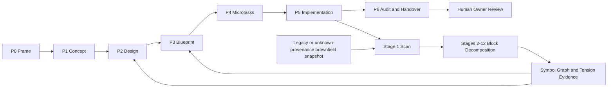

# Genesis Block Cycle — 7-Phase Assembly + 12-Stage Decomposition

## 1. Purpose

เอกสารนี้เป็น **Single Source of Truth (SSOT) สำหรับ RWANG** ในเรื่องชื่อ ลำดับ ความหมาย และ contract การเชื่อมของสอง pipeline ที่ประกอบเป็น **Genesis Block Cycle**:

1. **Block Assembly ↑** — การประกอบความรู้จากล่างขึ้นบนผ่าน 7 phases (`P0..P6`) จนเป็น implementation ที่ตรวจสอบได้
2. **Block Decomposition ↓** — การถอด codebase จากบนลงล่างผ่าน 12 stages เพื่อสร้าง structural knowledge และ feedback กลับเข้าสู่รอบ Assembly ถัดไป

เอกสารอื่นอธิบายวิธีเรียกใช้ เครื่องมือ หรือ storage ได้ แต่ห้ามนิยามชื่อ ลำดับ หรือความหมายของ P0–P6 และ Stage 1–12 ใหม่ หากเกิดความขัดแย้ง ให้เปิด Architecture Change Request และหยุดการเปลี่ยน semantics แบบเงียบ

## 2. Authority boundary

| Concern | Authority |
|---|---|
| ชื่อ ทิศทาง ลำดับ และความหมายของวงจร | เอกสารนี้ |
| กฎเรียก L0/L1/L2 และ planning evidence gate | `CODEBASE-SCAN.md` |
| RWANG Design Gates `DG0..DG6 + Execution` | `LIFECYCLE.md` |
| การคำนวณ snapshot, migration และ version audit | scripts ใต้ `skills/rwang/scripts/` |
| Graph backend, parser และ runtime implementation | repository-specific specs/implementation |

คำว่า **Phase** ใน RWANG หมายถึง Genesis Block Assembly `P0..P6` เท่านั้น ส่วนการวาง architecture ของ RWANG ใช้คำว่า **Design Gate** เพื่อไม่ให้เกิด phase model สองชุด

## 3. Canonical vocabulary

| Level | Canonical name | Direction | Legacy aliases |
|---|---|---|---|
| Umbrella | **Genesis Block Cycle** | closed loop | Doc-to-Code loop, MLL improvement loop |
| Bottom-up | **Block Assembly** | `P0 → P6` | 7-Phase Doc-to-Code Flow, Creation Lifecycle |
| Top-down | **Block Decomposition** | `Stage 1 → 12` | Symbol Graph DAG, 12-Stage Processing Pipeline |

ห้ามสลับทิศทาง: Assembly สร้างจาก intent/atoms ไปสู่ code และ audit; Decomposition เริ่มจาก code snapshot แล้วสกัดกลับเป็น structural knowledge

## 4. Cycle overview

**Legacy/unknown-provenance Stage 1 entry:** when a brownfield predates RWANG or its upstream provenance cannot be recovered, Stage 1 may start from the immutable/content-addressed snapshot without a P5 task/spec identity. The evidence packet must record `provenance: legacy` or `provenance: unknown`, missing upstream identities, scan authority, and known build/test status. Never fabricate a retroactive P5 identity; provenance gaps remain explicit evidence.

การ feedback จาก Decomposition กลับ P2/P3 เป็น **ข้อเสนอเชิงหลักฐาน** ไม่ใช่อำนาจแก้ design หรือ code อัตโนมัติ การเปลี่ยนที่กระทบ frozen contract ต้องผ่าน owner approval

## 5. Block Assembly ↑ — 7 phases (`P0..P6`)

### 5.1 Phase contract

| Phase | Canonical activity | Required input | Primary output | Exit condition |
|---|---|---|---|---|
| **P0 — Frame** | กำหนด universe, problem, scope และ Genesis Block boundary | owner intent หรือ evidence ของปัญหา | `FRAME--`, `IDEA--`, `GENESIS--` manifest | เป้าหมาย ขอบเขต ผู้มีอำนาจอนุมัติ และ non-goals ชัดเจน |
| **P1 — Concept** | แปลง frame เป็น business/technical concept ที่ตรวจ feasibility ได้ | approved P0 | `CONCEPT--`, high-level API draft | user value, constraints, feasibility และ failure assumptions ถูกบันทึก |
| **P2 — Design** | ตัดสิน architecture, entities, APIs, features และ invariants | approved P1 + code truth เมื่อเป็น brownfield | `ADR--`, `ENTITY--`, `API--`, `FEAT--`, protocol/spec artifacts | public contracts, rejected alternatives, risks และ approval state ชัดเจน |
| **P3 — Blueprint** | วาง implementation plan และ dependency order | approved P2 | `BLUEPRINT--` | file/module impact, test strategy, migration, rollout และ rollback ครบ |
| **P4 — Microtasks** | แตก blueprint เป็นงานเล็กที่ independently executable | approved P3 | `T*.task.yaml` หรือ machine-readable queue | ทุก task มี inputs, outputs, dependencies, acceptance และ verification โดยไม่ต้องตัดสิน architecture เพิ่ม |
| **P5 — Implementation** | สร้าง code/config/tests ตาม approved task | ready P4 task + approved contracts | implementation ใน `src/` และ test/evidence | task acceptance ผ่าน, trace กลับ spec/task ได้, ไม่มี silent architecture drift |
| **P6 — Audit and Handover** | ตรวจ deterministic acceptance, walkthrough และส่งมอบ | P5 artifact + verification results | `AUDIT--`, walkthrough/handover evidence | acceptance/exit criteria ผ่าน, known gaps เปิดเผย, owner รับ review package |

### 5.2 Phase invariants

- Phase number และลำดับ `P0 → P6` ห้ามเปลี่ยนโดยไม่มี approved Architecture Change Request
- ห้ามเริ่ม P5 ก่อน contract และ blueprint ที่เกี่ยวข้องได้รับ approval ตามระดับความเสี่ยง
- P4 อาจลดรูปสำหรับงานเล็กได้ แต่ต้องไม่ทำให้ acceptance, dependency หรือ traceability หาย
- Hotfix ที่ข้าม P1–P3 ต้องมี explicit hotfix authority, bounded scope และ backfill window ตาม project policy
- P6 ไม่เท่ากับ “มี test บางตัวผ่าน”; ต้องตรวจ acceptance, regression, documentation และ handover ครบ

## 6. Block Decomposition ↓ — 12 stages

### 6.1 Stage contract

| Stage | Canonical activity | Required evidence/output | Completion rule |
|---|---|---|---|
| **1 — Scan** | สำรวจ file paths, types และ sizes ภายใต้ declared scope | inventory + include/exclude boundary | ระบุสิ่งที่เห็น สิ่งที่ตัดออก และ scan timestamp/hash |
| **2 — Structure** | สร้าง hierarchy ของ workspace/folder/file | repository topology tree | source roots, manifests, generated/vendor boundaries แยกชัดเจน |
| **3 — Specialized Parse: Markdown** | สกัด atoms, headings, links และ governance metadata | Markdown/atom index | parse errors และ unsupported constructs ถูกเปิดเผย |
| **4 — Specialized Parse: COBOL** | สกัด legacy program/division/section relationships | COBOL AST/index หรือ `not_applicable` evidence | ถ้าไม่มี COBOL ต้องบันทึก N/A จาก Stage 1; ห้ามข้ามเงียบ |
| **5 — Symbolic Parse (Tree-sitter)** | สกัด functions, classes, methods, interfaces และ types | symbol table พร้อม file/line identity | parser/language coverage และ parse failures ถูกบันทึก |
| **6 — Framework: Routes** | ระบุ API/web/runtime entry routes | route-to-handler map หรือ evidenced N/A | dynamic/unresolved routes แสดงเป็น unknown |
| **7 — Framework: Tools** | ระบุ MCP tools, RPC handlers, commands และ callable surfaces | tool/handler contract map หรือ evidenced N/A | auth/permission boundary และ unresolved handlers เปิดเผย |
| **8 — Framework: ORM** | ระบุ schema, models, migrations และ persistence relations | model/schema relation map หรือ evidenced N/A | datastore coverage และ dynamic queries เปิดเผย |
| **9 — Cross-File Resolution** | เชื่อม imports, exports, references และ definitions ข้ามไฟล์ | resolved symbol/dependency edges | unresolved/ambiguous edges มีสถานะและเหตุผล |
| **10 — MRO** | สร้าง inheritance, implements และ method-resolution map | heritage/MRO edges | language-specific resolution rule และ conflicts ถูกบันทึก |
| **11 — Communities (Leiden)** | จัดกลุ่ม symbols/modules ตาม functional cohesion | deterministic community assignments | algorithm version, seed และ graph input hash ถูกบันทึก; หากยังไม่รันให้เป็น incomplete |
| **12 — Processes** | trace execution/data/control flow จาก entrypoint สู่ปลายทาง | process-flow paths พร้อม confidence | entrypoints, terminal effects, unresolved dynamic calls และ coverage ถูกบันทึก |

### 6.2 Stage invariants

- Stage number และลำดับ `1 → 12` เป็น canonical และห้าม rename/reorder เงียบ
- `grep`, file listing หรือ tree view เพียงอย่างเดียวไม่ใช่ completed Block Decomposition
- Stage ที่ไม่เกี่ยวข้องต้องใช้ `not_applicable` พร้อม evidence; stage ที่ tooling ยังทำไม่ได้ต้องใช้ `incomplete` ไม่ใช่ `complete`
- ทุก stage ต้องบันทึก input, method/tool, output, exclusions, confidence และ status
- L2 จะอ้างว่า complete ได้เมื่อทั้ง 12 stages เป็น `complete` หรือ evidenced `not_applicable` และ graph validation ผ่าน

## 7. Handoff contracts between both halves

The legacy/unknown-provenance Stage 1 entry above is an explicit exception to the P5 task/spec identity item in section 7.1; all other snapshot, scope, status, exclusion, and secrets evidence remains mandatory.

### 7.1 Assembly → Decomposition

ก่อนเริ่ม Stage 1 ต้องมีอย่างน้อย:

- immutable Git commit หรือ content-addressed source snapshot
- repository root และ declared scan scope
- build/test status ที่ทราบ ณ snapshot นั้น
- task/spec/Genesis Block identity ที่เชื่อม P5 artifact กับ intent
- exclusions และ secrets policy

### 7.2 Decomposition → Assembly

ผลลัพธ์ feedback ขั้นต่ำประกอบด้วย:

- snapshot hash เดียวกับ source input
- status ของ Stage 1–12
- Symbol Graph หรือ evidence packet ที่ระบุว่ายัง incomplete
- tension/drift findings ระหว่าง code truth กับ governed intent
- unresolved edges, unsupported parsers และ confidence limits
- proposed destination: P2 เมื่อ contract/design เปลี่ยน หรือ P3 เมื่อแผน implementation ต้องปรับ

Decomposition ห้ามเขียนทับ governed design โดยตรง

## 8. RWANG scan profiles versus the canonical cycle

| RWANG profile | Relationship to this SSOT | Planning authority |
|---|---|---|
| **L0 Inventory** | readiness check ก่อน Assembly; ไม่ใช่ Block Decomposition | เพียงพอสำหรับ greenfield ที่ไม่มี code |
| **L1 Reality Scan** | bounded brownfield evidence; อ่าน representative implementation แต่ไม่อ้างครบ 12 stages | ต้องผ่าน agent validation ก่อน Master Plan |
| **L2 Block Decomposition** | ใช้ Stage 1–12 ตามเอกสารนี้เต็มชุด | อ้าง complete ได้เฉพาะเมื่อผ่าน Stage invariants |

ดังนั้น brownfield ไม่จำเป็นต้องรัน L2 ทุกครั้ง แต่ห้ามสร้าง Master Plan จาก L0 file inventory อย่างเดียว

## 9. RWANG Design Gates are not the seven phases

`DG0..DG6 + Execution` เป็น architecture-governance envelope ของ RWANG ส่วน `P0..P6` เป็น artifact lifecycle ของ Genesis Block Assembly ทั้งสองแกนไม่จำเป็นต้อง map แบบหนึ่งต่อหนึ่ง

- Design Gates ตอบว่า architecture package อยู่ใน approval state ใด
- Assembly Phases ตอบว่า Genesis Block artifact อยู่ตรงไหนใน doc-to-code flow
- Decomposition Stages ตอบว่า code snapshot ถูกวิเคราะห์เชิงโครงสร้างลึกแค่ไหน

ทุก state/report ต้องระบุ axis ให้ชัด เช่น `design_gate: DG2`, `assembly_phase: P3`, `decomposition_stage: 9`

## 10. Evidence and truth states

ทุก claim สำคัญต้องอยู่ในหนึ่งสถานะ:

| State | Meaning |
|---|---|
| `confirmed_code_truth` | ตรวจจาก code/runtime/test ของ snapshot ที่ระบุ |
| `documented_intent` | มาจาก spec/owner material แต่ยังไม่ยืนยันจาก implementation |
| `inferred` | สรุปจากหลักฐานหลายส่วนและต้องระบุ reasoning/confidence |
| `unknown` | ยังไม่มีหลักฐานพอ ห้ามเดาให้กลายเป็น fact |

## 11. Conformance requirements

Implementation หรือ skill ที่อ้างว่า conform ต้องผ่านทั้งหมด:

- ใช้ชื่อและลำดับ P0–P6 และ Stage 1–12 ตรงกับเอกสารนี้
- ไม่สร้าง phase/stage ชุดคู่แข่งโดยใช้หมายเลขเดียวกัน
- brownfield planning อ้าง L1/L2 evidence ที่ agent ตรวจ implementation จริง
- L2 completion มี per-stage status และ snapshot hash
- feedback จาก Decomposition กลับ Assembly ผ่าน governance/approval boundary
- เอกสารรองอ้าง SSOT นี้แทนการคัดลอก definition
- validator ตรวจได้ว่า SSOT มีครบ 7 phases และ 12 stages

## 12. Change control

การเปลี่ยนชื่อ ลำดับ semantics, entry/exit contract หรือ direction ของ phase/stage เป็น **MAJOR architecture change** ต้องมี:

1. Architecture Change Request
2. impact ต่อ state/schema/scripts/templates และ legacy projects
3. migration plan
4. owner approval
5. version bump และ changelog update

การเพิ่มคำอธิบายหรือ evidence field โดยไม่เปลี่ยน semantics เป็น MINOR/PATCH ตามผลกระทบ

## 13. Upstream provenance

SSOT นี้สังเคราะห์จาก canonical upstream ต่อไปนี้ ณ วันที่สร้าง:

- `G:/cognitive_system/docs/gks/PRD--GENESIS-BLOCK-CYCLE.md`
- `G:/cognitive_system/gks/framework/FRAMEWORK--PHASE-GOVERNANCE.md`
- `G:/cognitive_system/FRAMEWORK_MASTER_SPEC.md` §6.1 และ §8.1

ภายใน installed RWANG bundle เอกสารนี้เป็น operational authority; upstream เป็น provenance และ source สำหรับ reconciliation หาก upstream เปลี่ยน ต้อง review diff และ bump version ห้าม sync semantics อัตโนมัติ

## CHANGELOG

| Version | Date | Status | Summary | Commit Hash | Agent |
|---|---|---|---|---|---|
| `0.2.0b` | 2026-07-19 | candidate | Added an explicit Stage 1 entry contract for legacy or unknown-provenance brownfield snapshots without fabricating a P5 artifact. | null | Luna |
| `0.1.0b` | 2026-07-19 | candidate | รวม Block Assembly P0–P6 และ Block Decomposition Stage 1–12 เป็น RWANG operational SSOT พร้อม handoff, evidence และ conformance contracts | null | ATHER |
